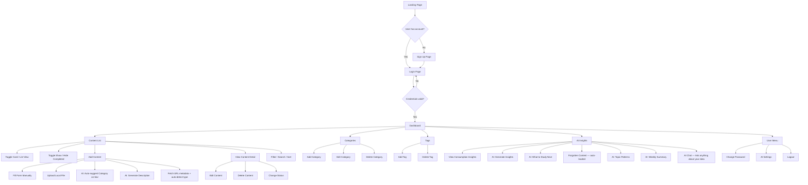
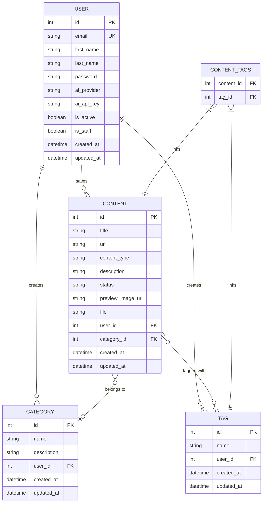

# StudyHub — Product Requirements Document (PRD)

> **Version:** 1.1  
> **Date:** March 26, 2026  
> **Status:** Implemented  
> **Stack:** Python · Django · SQLite · TailwindCSS · Django Template Language

---

## Table of Contents

1. [Overview](#1-overview)
2. [About the Product](#2-about-the-product)
3. [Purpose](#3-purpose)
4. [Target Audience](#4-target-audience)
5. [Objectives](#5-objectives)
6. [Functional Requirements](#6-functional-requirements)
7. [Non-Functional Requirements](#7-non-functional-requirements)
8. [Technical Architecture](#8-technical-architecture)
9. [Design System](#9-design-system)
10. [User Stories](#10-user-stories)
11. [Success Metrics](#11-success-metrics)
12. [Risks and Mitigations](#12-risks-and-mitigations)
13. [Task List — Sprints](#13-task-list--sprints)

---

## 1. Overview

StudyHub is a full-stack web application built with Python and Django that serves as a personal learning content management system. It centralizes content scattered across multiple platforms — website links, YouTube videos, podcasts, online courses, books, tools, and other resources — into a single, organized workspace. The system helps users save, categorize, track, and review their learning materials while providing AI-powered insights about their study habits.

---

## 2. About the Product

StudyHub addresses a common pain point for lifelong learners, professionals, and students: the fragmentation of learning resources across multiple platforms. Bookmarks get lost, saved videos pile up unwatched, and there is no unified view of what has been consumed, what is in progress, and what remains to be explored.

The product offers a clean, modern dark-themed interface where users can manage their content pipeline from saving to completion. AI features assist with auto-categorization, description generation, summarization, and consumption insights — keeping the experience smart without over-engineering.

**Key characteristics:**

- Django full-stack monolith (no separate frontend framework)
- Django Template Language with TailwindCSS for a modern, responsive UI
- Native Django authentication with email-based login
- SQLite as the default database
- Class-Based Views as the primary pattern
- Modular Django apps for domain separation

---

## 3. Purpose

The purpose of StudyHub is to provide a centralized, organized, and intelligent system for managing learning content. It eliminates the friction of scattered resources by offering a single dashboard where users can:

- Save content from any platform with a URL or manual entry
- Categorize and tag content for easy retrieval
- Track consumption progress (new, in progress, completed)
- Gain insights into their learning patterns and habits via AI
- Get AI-powered suggestions for categorization and descriptions

---

## 4. Target Audience

| Segment | Description |
|---|---|
| **Self-learners** | Individuals who consume online courses, tutorials, articles, and videos across multiple platforms |
| **Students** | University or technical school students who need to organize study materials |
| **Professionals** | Knowledge workers who save and curate content related to their careers (QA, AI, software dev, design, etc.) |
| **Content curators** | People who actively collect and organize reference material for later consumption |

**Common traits:** digitally active, consume content across 3+ platforms, value organization, have a backlog of saved content they struggle to manage.

---

## 5. Objectives

| # | Objective | Description |
|---|---|---|
| O1 | **Centralize content** | Provide a single platform to save content from any source |
| O2 | **Enable organization** | Allow categorization, tagging, and status tracking |
| O3 | **Visualize progress** | Offer a dashboard with statistics and an overview of consumption |
| O4 | **Leverage AI** | Provide smart categorization, descriptions, summaries, and consumption insights |
| O5 | **Keep it simple** | Avoid over-engineering; use Django native features whenever possible |
| O6 | **Modern UX** | Deliver a responsive, dark-themed interface with a cohesive design system |

---

## 6. Functional Requirements

### 6.1 Public Landing Page

- **FR-01:** The system must have a public landing page presenting the product
- **FR-02:** The landing page must have "Sign Up" and "Log In" call-to-action buttons
- **FR-03:** The landing page must present the product's value proposition, features, and benefits

### 6.2 Authentication

- **FR-04:** Users must register with email, password, and full name
- **FR-05:** Login must use email (not username) as the credential
- **FR-06:** The system must use Django's native authentication system with a custom user model
- **FR-07:** After successful login, the user is redirected to the main dashboard
- **FR-08:** Users must be able to log out from any page
- **FR-09:** Password change functionality must be available

### 6.3 Dashboard

- **FR-10:** The dashboard must display an aggregated overview of the user's content
- **FR-11:** The dashboard must show total content count, breakdown by status (new, in progress, completed), and breakdown by content type
- **FR-12:** The dashboard must show recent activity (recently added and recently completed items)
- **FR-13:** The dashboard must display the top categories and tags used

### 6.4 Content Management

- **FR-14:** Users must be able to create content entries with: title, URL (optional), content type, description (optional), category (optional), tags (optional), and status
- **FR-15:** Supported content types: article, video, podcast, course, book, tool, other
- **FR-16:** Content statuses: new, in_progress, completed
- **FR-17:** Users must be able to list all saved content with search, filter, and sorting capabilities
- **FR-18:** Users must be able to view, edit, and delete their content entries
- **FR-19:** Content listing must support filtering by: status, content type, category, and tags
- **FR-20:** Content listing must support sorting by: date added (newest/oldest), title (A–Z / Z–A), and category
- **FR-21:** Content listing must support text search across title and description
- **FR-22:** Users must be able to toggle between a card grid view and a list view on the content listing page. The selected view preference must persist across page reloads via `localStorage`
- **FR-23:** In card view, each content item must display a thumbnail image selected by priority: (1) the uploaded image file if it is an image type, (2) the Open Graph preview image extracted from the content URL, or (3) a content-type-specific placeholder icon if neither is available
- **FR-24:** Users must be able to upload a local file (PDF, image, audio, video, document) when creating content, as an alternative to providing a URL
- **FR-25:** File uploads must be restricted to allowed formats (PDF, JPG, JPEG, PNG, GIF, WebP, MP3, MP4, DOC, DOCX, TXT, MD) and a maximum size of 10MB
- **FR-26:** The content listing must be paginated (12 items per page)
- **FR-27:** The content listing must hide completed items by default and provide a toggle to show/hide completed content
- **FR-28:** When a URL is entered on the content form, the system must fetch Open Graph metadata (title and description) on field blur and auto-fill the title and description fields if they are empty. The fetch is user-triggered (field blur), never on every page render
- **FR-29:** When a URL is entered on the content form, the system may auto-detect the content type from the URL host (e.g. YouTube → video, Spotify → podcast, Udemy/Coursera → course) and set the type field if the user has not made a selection
- **FR-30:** On the content edit form, a "Refresh Preview" button must allow the user to re-fetch the Open Graph image for the saved URL on demand

### 6.5 Categories

- **FR-31:** Users must be able to create, edit, and delete categories
- **FR-32:** Each category must have a name and optional description
- **FR-33:** Categories are user-scoped (each user has their own categories)
- **FR-34:** Users must be able to list their categories with the number of contents in each

### 6.6 Tags

- **FR-35:** Users must be able to create and delete tags
- **FR-36:** Each tag must have a name
- **FR-37:** Tags are user-scoped
- **FR-38:** Tags can be assigned to content (many-to-many relationship)
- **FR-39:** Users must be able to list their tags with the number of contents in each

### 6.7 AI Insights

- **FR-40:** The system must offer AI-powered suggestion of a category for new content based on title and URL. The suggestion runs automatically when the user leaves the title field (on blur) and pre-selects the suggested category with an "AI suggested" indicator; the user can override the selection
- **FR-41:** The system must offer AI-powered generation of a description for new content, triggered by an explicit "AI Generate" button on the content form
- **FR-42:** The system must offer AI-powered consumption insights on the Insights page (e.g., reading habits, suggestions), triggered by an explicit button click
- **FR-43:** AI features must be user-triggered (field blur, button click, or chat message), never invoked automatically on page render or on a schedule. The AI service must remain optional: the app works fully when the AI provider/key is unavailable, and all AI endpoints return a graceful error on failure

### 6.8 Personalized AI Learning Intelligence

- **FR-44:** The system must offer a "What to Study Next" AI feature that analyzes the user's content marked as New or In Progress and recommends a prioritized list of items to study next, based on recency, category patterns, and consumption history. Triggered by user action.
- **FR-45:** The system must identify "forgotten" content: items saved more than 30 days ago that have never progressed beyond "New" status. These items are loaded automatically into a dedicated section on the Insights page (a read-only ORM query, not an AI call) so the user can act on them (study, archive, or delete).
- **FR-46:** The system must detect recurring topics from the user's tags and categories and suggest opportunities for deeper study (e.g., "You have 9 items tagged 'Python' — consider exploring advanced topics"). AI-generated. Triggered by user action.
- **FR-47:** The system must generate a weekly learning summary: a concise narrative covering how many items were completed that week, how many remain in progress, and which category or tag was most active. Displayed on the Insights page. Triggered by user action (not automatic).

### 6.9 AI Chat (Learning Assistant)

- **FR-48:** The Insights page must include an AI chat interface where the user can ask natural language questions about their learning data. Examples: "What topics am I studying most?", "Which content have I been procrastinating on?", "Suggest a study plan for this week."
- **FR-49:** The chat must use a RAG-like approach: before each AI call, the system builds a structured context snapshot from the user's database — content titles, types, statuses, categories, tags, and completion history — and injects it into the AI prompt alongside the user's question. No external vector store is required; the context is assembled in Python from ORM queries.
- **FR-50:** The chat must support multi-turn conversation within a session (the UI maintains a visible message history; prior messages are included in subsequent AI calls as context).
- **FR-51:** The chat history must not be persisted to the database. It lives only in the browser session. On page reload, the conversation resets.
- **FR-52:** The chat must handle AI errors gracefully: if the API call fails, display a clear error message in the chat UI without crashing the page.
- **FR-53:** AI calls must be rate-limited per session per action (e.g. chat: 20/day; insights/suggest-next/topics/weekly-summary: 5/hour) to control API cost and abuse.

### 6.10 UX Flowchart



---

## 7. Non-Functional Requirements

| # | Requirement | Description |
|---|---|---|
| NFR-01 | **Responsive Design** | The interface must be fully functional on desktop (1024px+), tablet (768px), and mobile (375px) viewports |
| NFR-02 | **Dark Theme** | The application must use a dark color scheme with gradient accents |
| NFR-03 | **Performance** | Pages must load within 2 seconds on a standard connection |
| NFR-04 | **Security** | Django CSRF protection, secure password hashing, login-required for all authenticated views |
| NFR-05 | **Code Standards** | PEP 8 compliance, single quotes, English code, Class-Based Views |
| NFR-06 | **Database** | SQLite (Django default) — no external database dependencies |
| NFR-07 | **Modularity** | Domain entities separated into individual Django apps |
| NFR-08 | **Timestamps** | Every model must have `created_at` and `updated_at` fields |
| NFR-09 | **Accessibility** | Semantic HTML, proper labels, keyboard navigation support |
| NFR-10 | **Browser Support** | Modern browsers (Chrome, Firefox, Safari, Edge — latest 2 versions) |

---

## 8. Technical Architecture

### 8.1 Stack

| Layer | Technology |
|---|---|
| **Language** | Python 3.13+ |
| **Framework** | Django 6.x |
| **Database** | SQLite 3 (Django default) |
| **Frontend** | Django Template Language (DTL) |
| **CSS** | TailwindCSS (via CDN) |
| **AI** | Anthropic Claude API (via `anthropic` SDK) **or** OpenAI GPT API (via `openai` SDK) — user-configurable per account |
| **Auth** | Django native auth with custom User model |
| **Server** | Django development server; `gunicorn` + `whitenoise` for production |
| **Link Preview** | `requests` + `beautifulsoup4` (Open Graph metadata extraction, with YouTube oEmbed fallback) |
| **File Storage** | Django `FileField` with local media storage |

### 8.2 Django Apps Structure

| App | Responsibility |
|---|---|
| `core` | Project settings, root URL configuration, base templates, static files |
| `users` | Custom user model (email-based login), registration, authentication, password change, AI provider/key settings views |
| `contents` | Content CRUD, filtering, search, status management |
| `categories` | Category CRUD, user-scoped management |
| `tags` | Tag CRUD, user-scoped management |
| `insights` | AI service integration (Anthropic/OpenAI), insight generation views, AI chat |
| `dashboard` | Aggregated statistics, overview views |

### 8.3 Data Schema



### 8.4 Content Type Choices

```
CONTENT_TYPE_CHOICES = [
    ('article', 'Article'),
    ('video', 'Video'),
    ('podcast', 'Podcast'),
    ('course', 'Course'),
    ('book', 'Book'),
    ('tool', 'Tool'),
    ('other', 'Other'),
]
```

### 8.5 Status Choices

```
STATUS_CHOICES = [
    ('new', 'New'),
    ('in_progress', 'In Progress'),
    ('completed', 'Completed'),
]
```

---

## 9. Design System

The design system defines a consistent, modern dark-themed visual identity applied across all templates using TailwindCSS utility classes within Django Template Language.

### 9.1 Color Palette

| Token | TailwindCSS Class | Hex | Usage |
|---|---|---|---|
| **Background Primary** | `bg-zinc-950` | `#09090b` | Page background |
| **Background Secondary** | `bg-zinc-900` | `#18181b` | Cards, panels, sidebar, topbar |
| **Background Tertiary** | `bg-zinc-800` | `#27272a` | Input fields, hover states, toggle groups |
| **Surface** | `bg-zinc-900/80` | — | Topbar (backdrop-blur), elevated surfaces |
| **Border** | `border-zinc-800` | `#27272a` | Card borders, dividers |
| **Border Hover** | `border-zinc-700` | `#3f3f46` | Hovered card borders |
| **Text Primary** | `text-white` / `text-zinc-100` | `#ffffff` / `#fafafa` | Headings, primary text |
| **Text Secondary** | `text-zinc-400` | `#a1a1aa` | Descriptions, labels, nav items |
| **Text Muted** | `text-zinc-500` / `text-zinc-600` | `#71717a` / `#52525b` | Placeholders, hints, meta text |
| **Accent Primary** | `text-green-400` | `#4ade80` | Primary actions, active nav, links |
| **Accent Gradient From** | `from-green-600` | `#16a34a` | Gradient start (primary buttons, CTA) |
| **Accent Gradient To** | `to-emerald-600` | `#059669` | Gradient end (primary buttons, CTA) |
| **Accent Gradient Hover** | `hover:from-green-500 hover:to-emerald-500` | — | Primary button hover |
| **Brand Gradient (text)** | `from-green-400 to-emerald-400 bg-clip-text text-transparent` | — | Logo / wordmark |
| **Success** | `text-emerald-400` | `#34d399` | Completed status, success messages |
| **Warning** | `text-amber-400` | `#fbbf24` | In-progress status |
| **Danger** | `text-rose-400` / `text-rose-500` | `#fb7185` / `#f43f5e` | Delete actions, errors |
| **Info** | `text-sky-400` | `#38bdf8` | New status |

#### Content-type badge colors

| Content type | Badge classes |
|---|---|
| Article | `bg-violet-500/10 text-violet-400` |
| Video | `bg-rose-500/10 text-rose-400` |
| Podcast | `bg-orange-500/10 text-orange-400` |
| Course | `bg-cyan-500/10 text-cyan-400` |
| Book | `bg-emerald-500/10 text-emerald-400` |
| Tool | `bg-pink-500/10 text-pink-400` |
| Other | `bg-gray-500/10 text-gray-400` |

### 9.2 Gradient Patterns

```html
<!-- Primary gradient (buttons, accents, hero sections) -->
<div class="bg-gradient-to-r from-green-600 to-emerald-600">

<!-- Subtle background gradient (cards, onboarding panels) -->
<div class="bg-gradient-to-br from-zinc-900 via-zinc-900 to-zinc-800/30">

<!-- Text gradient (brand / wordmark) -->
<h1 class="bg-gradient-to-r from-green-400 to-emerald-400 bg-clip-text text-transparent">

<!-- Icon container gradient -->
<div class="bg-gradient-to-br from-green-400 to-emerald-500">

<!-- Border/ring accent effect -->
<div class="ring-1 ring-green-500/20">
```

### 9.3 Typography

| Element | TailwindCSS Classes |
|---|---|
| **Font Family** | `font-sans` (Inter via Google Fonts, with system-ui fallback) |
| **Page Title** | `text-3xl font-bold text-white` |
| **Section Title** | `text-lg font-semibold text-white` |
| **Card Title** | `text-sm font-medium text-white` |
| **Body Text** | `text-sm text-zinc-400` |
| **Label** | `block text-sm font-medium text-zinc-400 mb-1` |
| **Helper Text** | `text-xs text-zinc-600` |

### 9.4 Buttons

```html
<!-- Primary Button -->
<button class="px-4 py-2 bg-gradient-to-r from-green-600 to-emerald-600 
    text-white text-sm font-medium rounded-lg 
    hover:from-green-500 hover:to-emerald-500 
    transition-all duration-200 shadow-lg shadow-green-500/25">
    Save Content
</button>

<!-- Secondary Button -->
<button class="px-4 py-2 bg-zinc-800 text-zinc-300 text-sm font-medium rounded-lg 
    border border-zinc-700 hover:bg-zinc-700 hover:text-white 
    transition-all duration-200">
    Cancel
</button>

<!-- Danger Button -->
<button class="px-4 py-2 bg-rose-600/10 text-rose-400 text-sm font-medium rounded-lg 
    border border-rose-500/20 hover:bg-rose-600/20 
    transition-all duration-200">
    Delete
</button>

<!-- Ghost / Icon Button -->
<button class="p-1.5 text-zinc-500 hover:text-zinc-200 hover:bg-zinc-800 rounded-lg 
    transition-all duration-200">
    <!-- icon -->
</button>
```

### 9.5 Form Inputs

```html
<!-- Text Input -->
<input type="text" 
    class="w-full px-3 py-2.5 bg-zinc-800 border border-zinc-700 rounded-lg 
    text-zinc-100 text-sm placeholder-zinc-500 
    focus:outline-none focus:ring-2 focus:ring-green-500/40 focus:border-green-500/50 
    transition-all duration-200" 
    placeholder="Enter title...">

<!-- Select -->
<select class="w-full px-3 py-2.5 bg-zinc-800 border border-zinc-700 rounded-lg 
    text-zinc-100 text-sm 
    focus:outline-none focus:ring-2 focus:ring-green-500/40 focus:border-green-500/50 
    transition-all duration-200">
    <option>Select category</option>
</select>

<!-- Textarea -->
<textarea class="w-full px-3 py-2.5 bg-zinc-800 border border-zinc-700 rounded-lg 
    text-zinc-100 text-sm placeholder-zinc-500 
    focus:outline-none focus:ring-2 focus:ring-green-500/40 focus:border-green-500/50 
    transition-all duration-200 resize-none" 
    rows="4" placeholder="Description..."></textarea>

<!-- Label -->
<label class="block text-sm font-medium text-zinc-400 mb-1">Title</label>

<!-- Error message -->
<p class="mt-1 text-xs text-rose-400">This field is required.</p>
```

### 9.6 Cards

```html
<!-- Standard Card -->
<div class="bg-zinc-900 border border-zinc-800 rounded-xl p-5 
    hover:border-zinc-700 transition-all duration-200">
    <!-- content -->
</div>

<!-- Stats Card -->
<div class="bg-zinc-900 border border-zinc-800 rounded-xl p-5 
    hover:border-zinc-700 transition-all duration-200">
    <p class="text-sm text-zinc-400">Total Contents</p>
    <p class="text-3xl font-bold text-white mt-1">128</p>
</div>
```

### 9.7 Navigation & Sidebar

```html
<!-- Sidebar container -->
<aside class='w-64 shrink-0 bg-zinc-900 border-r border-zinc-800 min-h-screen flex flex-col p-4'>

<!-- Sidebar nav item (active) -->
<a class='flex items-center gap-3 px-3 py-2 rounded-lg text-sm font-medium 
    bg-green-500/10 text-green-400'>
    <!-- icon --> Dashboard
</a>

<!-- Sidebar nav item (default) -->
<a class='flex items-center gap-3 px-3 py-2 rounded-lg text-sm font-medium 
    text-zinc-400 hover:bg-zinc-800 hover:text-zinc-100 
    transition-all duration-200'>
    <!-- icon --> Contents
</a>
```

The sidebar is fixed-width (`w-64`) on `md+` screens and collapses into a slide-in drawer with an overlay on mobile (`< md`). The top bar (`h-16`, sticky, backdrop-blur) hosts the page title, the user email, links to **AI Settings** and **Password change**, and a **Logout** form button.

### 9.8 Status Badges

```html
<!-- New -->
<span class="px-2.5 py-0.5 text-xs font-medium rounded-full bg-sky-500/10 text-sky-400 border border-sky-500/20">New</span>

<!-- In Progress -->
<span class="px-2.5 py-0.5 text-xs font-medium rounded-full bg-amber-500/10 text-amber-400 border border-amber-500/20">In Progress</span>

<!-- Completed -->
<span class="px-2.5 py-0.5 text-xs font-medium rounded-full bg-emerald-500/10 text-emerald-400 border border-emerald-500/20">Completed</span>
```

### 9.9 Content Type Badges

```html
<!-- Article -->
<span class="px-2.5 py-0.5 text-xs font-medium rounded-full bg-violet-500/10 text-violet-400">Article</span>

<!-- Video -->
<span class="px-2.5 py-0.5 text-xs font-medium rounded-full bg-rose-500/10 text-rose-400">Video</span>

<!-- Podcast -->
<span class="px-2.5 py-0.5 text-xs font-medium rounded-full bg-orange-500/10 text-orange-400">Podcast</span>

<!-- Course -->
<span class="px-2.5 py-0.5 text-xs font-medium rounded-full bg-cyan-500/10 text-cyan-400">Course</span>

<!-- Book -->
<span class="px-2.5 py-0.5 text-xs font-medium rounded-full bg-emerald-500/10 text-emerald-400">Book</span>

<!-- Tool -->
<span class="px-2.5 py-0.5 text-xs font-medium rounded-full bg-pink-500/10 text-pink-400">Tool</span>

<!-- Other -->
<span class="px-2.5 py-0.5 text-xs font-medium rounded-full bg-gray-500/10 text-gray-400">Other</span>
```

### 9.10 Grid & Layout

```html
<!-- Page Layout (sidebar + main) -->
<div class="flex min-h-screen bg-zinc-950">
    <aside class="w-64 ..."><!-- sidebar --></aside>
    <main class="flex-1 p-4 md:p-6"><!-- content --></main>
</div>

<!-- Stats Grid -->
<div class="grid grid-cols-1 sm:grid-cols-2 lg:grid-cols-4 gap-4">

<!-- Content Cards Grid -->
<div class="grid grid-cols-1 md:grid-cols-2 xl:grid-cols-3 gap-4">

<!-- Form Layout -->
<div class="max-w-2xl mx-auto">

<!-- Insights two-column grid (AI cards + chat) -->
<div class="grid grid-cols-1 lg:grid-cols-12 gap-6">
```

### 9.11 Base Template Structure

All pages extend a `base.html` template that provides:

- TailwindCSS CDN link with Inter font
- Sidebar navigation (for authenticated pages)
- Top bar with user menu
- Flash messages / notification area
- Content block for page-specific content
- A separate `base_public.html` for unauthenticated pages (landing, login, register)

### 9.12 Content Card

```html
<!-- Content Card -->
<div class="bg-zinc-900 border border-zinc-800 rounded-xl overflow-hidden 
    hover:border-zinc-700 transition-all duration-200 flex flex-col">
    
    <!-- Image Area -->
    <div class="aspect-video bg-zinc-800 relative overflow-hidden">
        
        <!-- Type badge overlay -->
        <span class="absolute top-2 right-2 px-2 py-0.5 text-xs font-medium rounded-full 
            bg-zinc-900/80 text-zinc-300 backdrop-blur-sm">
            {{ content.get_content_type_display }}
        </span>
    </div>
    
    <!-- Card Body -->
    <div class="p-4 flex flex-col flex-1 gap-2">
        <h3 class="text-sm font-medium text-white line-clamp-2">{{ content.title }}</h3>
        <p class="text-xs text-zinc-500 line-clamp-2">{{ content.description }}</p>
        <div class="mt-auto flex items-center justify-between pt-3">
            <!-- Status badge -->
            <span class="px-2 py-0.5 text-xs font-medium rounded-full ...">{{ status }}</span>
            <span class="text-xs text-zinc-600">{{ content.created_at|date:"M d" }}</span>
        </div>
    </div>
</div>
```

```html
<!-- View Toggle Buttons -->
<div class="flex items-center gap-1 bg-zinc-800/60 rounded-lg p-0.5" role="group" aria-label="View toggle">
    <button id="btn-view-cards" data-view="cards" type="button"
        class="p-1.5 rounded-md transition-all duration-200"
        aria-label="Card grid view">
        <!-- grid icon -->
    </button>
    <button id="btn-view-list" data-view="list" type="button"
        class="p-1.5 rounded-md transition-all duration-200"
        aria-label="List view">
        <!-- list icon -->
    </button>
</div>
```

The active toggle button receives `bg-zinc-700 text-white`; the inactive one stays `text-gray-400`. The preference is persisted in `localStorage` under the key `studyhub_content_view`.

---

## 10. User Stories

### Epic 1: Public Experience

> **E1 — As a visitor, I want to understand what StudyHub offers so I can decide to sign up.**

| ID | Story | Acceptance Criteria |
|---|---|---|
| US-01 | As a visitor, I want to see a landing page that explains the product | Landing page displays hero section, feature list, and CTA buttons. Page is responsive. |
| US-02 | As a visitor, I want to sign up for an account | Registration form with email, full name, password, and password confirmation. Validation errors are shown inline. On success, user is redirected to login. |
| US-03 | As a visitor, I want to log in with my email | Login form with email and password. On success, redirect to dashboard. On failure, show error message. |

### Epic 2: Dashboard

> **E2 — As a user, I want to see an overview of my saved content and learning progress.**

| ID | Story | Acceptance Criteria |
|---|---|---|
| US-04 | As a user, I want to see summary stats on my dashboard | Dashboard shows: total content count, count by status (new, in progress, completed), count by content type. |
| US-05 | As a user, I want to see my recent activity | Dashboard shows the 5 most recently added items and the 5 most recently completed items. |
| US-06 | As a user, I want to see my top categories and tags | Dashboard shows the top 5 categories and top 5 tags ranked by content count. |

### Epic 3: Content Management

> **E3 — As a user, I want to save, organize, and track my learning content.**

| ID | Story | Acceptance Criteria |
|---|---|---|
| US-07 | As a user, I want to add new content | Form with: title, URL (optional), content type (required), description (optional), category (optional), tags (optional), status (default: new), file (optional). When a URL is entered, the form fetches its Open Graph metadata on blur and auto-fills empty title/description fields and may auto-detect the content type. Content is saved and user is redirected to content list. |
| US-08 | As a user, I want to list all my content | Content list page with all saved items showing title, type badge, status badge, category, and date added. The list is pagated (12 items per page) and hides completed items by default, with a toggle to reveal them. |
| US-09 | As a user, I want to filter my content list | Filters available for: status, content type, category. Filters update the list via form submission. |
| US-10 | As a user, I want to search my content | Text search across title and description. Search can be combined with filters. |
| US-11 | As a user, I want to sort my content list | Sorting options: newest first (default), oldest first, title A-Z, title Z-A, and category. |
| US-12 | As a user, I want to view content details | Detail page showing all content fields, with options to edit, delete, or change status. |
| US-13 | As a user, I want to edit my content | Edit form pre-filled with current values, with a "Refresh Preview" button to re-fetch the Open Graph image for the saved URL. On save, redirect to detail page. |
| US-14 | As a user, I want to delete my content | Delete confirmation prompt. On confirm, content is deleted and user is redirected to content list. |
| US-15 | As a user, I want to quickly change content status | Status can be changed from the detail page via dedicated "Mark as New / In Progress / Completed" buttons. |
| US-16 | As a user, I want to see my content in a card grid view with thumbnail images | Content list has a toggle for card/list view. Cards show a thumbnail chosen by priority: uploaded image file (if an image type) → Open Graph preview image → content-type placeholder. Toggle preference persists via `localStorage`. |
| US-17 | As a user, I want to see link preview images on my content cards | When content has a URL, the system extracts the Open Graph image (with a YouTube oEmbed fallback) and displays it on the card. If no preview image is found, a content-type placeholder is shown. |
| US-18 | As a user, I want to upload a local file when saving content | Content form has an optional file upload field. Accepted formats: PDF, JPG, JPEG, PNG, GIF, WebP, MP3, MP4, DOC, DOCX, TXT, MD. Max size: 10MB. Validation is enforced both client-side and server-side. |

### Epic 4: Categories

> **E4 — As a user, I want to create and manage categories to organize my content.**

| ID | Story | Acceptance Criteria |
|---|---|---|
| US-19 | As a user, I want to create a category | Form with name (required) and description (optional). Category is user-scoped. |
| US-20 | As a user, I want to list my categories | List showing category name, description, and number of contents. |
| US-21 | As a user, I want to edit a category | Edit form pre-filled with current values. |
| US-22 | As a user, I want to delete a category | Delete confirmation. Contents in the category are not deleted (category is set to null). |

### Epic 5: Tags

> **E5 — As a user, I want to create and manage tags for flexible content classification.**

| ID | Story | Acceptance Criteria |
|---|---|---|
| US-23 | As a user, I want to create a tag | Form with name (required). Tag is user-scoped. Duplicate names per user are not allowed. |
| US-24 | As a user, I want to list my tags | List showing tag name and number of contents. |
| US-25 | As a user, I want to delete a tag | Delete confirmation. Tag is removed from all contents it was assigned to. |

### Epic 6: AI Features

> **E6 — As a user, I want AI to help me organize and understand my content better.**

| ID | Story | Acceptance Criteria |
|---|---|---|
| US-26 | As a user, I want AI to suggest a category for my content | When I leave the title field on the content form, the system automatically calls the AI with the title and URL and pre-selects a matching category, flagged with an "AI suggested" indicator. I can override the selection manually. |
| US-27 | As a user, I want AI to generate a description for my content | An "AI Generate" button on the content form triggers an AI call with title, URL, and content type. The generated description populates the description field. I can edit it before saving. |
| US-28 | As a user, I want AI to provide insights about my consumption habits | The Insights page offers an "Analyze" button that produces an AI-generated analysis of: content type distribution, completion rate, and suggestions for improvement. Triggered by explicit button click. |

### Epic 7: Personalized AI Learning Intelligence

> **E7 — As a user, I want AI to help me prioritize and reflect on my learning habits.**

| ID | Story | Acceptance Criteria |
|---|---|---|
| US-31 | As a user, I want AI to tell me what I should study next | A "What to Study Next" button on the Insights page sends my New and In Progress content to the AI and returns a prioritized recommendation list. |
| US-32 | As a user, I want to see content I have been neglecting | The Insights page shows a "Forgotten Content" section listing items saved more than 30 days ago with status still "New". I can click through to each item. |
| US-33 | As a user, I want AI to identify my recurring topics and suggest depth | A "Topic Patterns" button analyzes my most used tags and categories and returns AI-generated suggestions for deepening my knowledge in those areas. |
| US-34 | As a user, I want a weekly summary of my learning activity | A "Weekly Summary" button generates a short narrative about my activity over the past 7 days: completions, in-progress items, and most active topic area. |

### Epic 8: AI Chat — Learning Assistant

> **E8 — As a user, I want to have a conversation with an AI assistant about my learning data.**

| ID | Story | Acceptance Criteria |
|---|---|---|
| US-35 | As a user, I want to ask free-form questions about my content | The Insights page has a chat panel where I can type a question and receive an AI-generated answer grounded in my actual data. |
| US-36 | As a user, I want the AI to remember the context of our conversation | Sending follow-up messages in the same session includes the previous turns in the AI prompt. The chat history is visible in the UI. |
| US-37 | As a user, I want the chat to reset when I reload the page | The conversation is session-only. There is no persistent chat history in the database. A fresh conversation starts on each page load. |
| US-38 | As a user, I want clear feedback if the AI is unavailable | If the AI API fails, the chat shows a friendly error message without breaking the page. |

### Epic 9: Account Management

> **E9 — As a user, I want to manage my account securely.**

| ID | Story | Acceptance Criteria |
|---|---|---|
| US-29 | As a user, I want to change my password | Password change form with current password, new password, and confirmation. Uses Django's native password change view. |
| US-30 | As a user, I want to log out | Logout button accessible from any authenticated page. Redirects to landing page. |
| US-39 | As a user, I want to configure my AI provider and API key | A Settings screen allows choosing between Anthropic (Claude) and OpenAI (GPT) and saving an API key. The key is stored per user (in plaintext — a dedicated/restricted key is recommended) and used for all AI features. If no user key is set, the server-side `ANTHROPIC_API_KEY` env var is used as a fallback for the Anthropic provider. |

---

## 11. Success Metrics

### 11.1 Product KPIs

| KPI | Description | Target |
|---|---|---|
| **Content saved per user** | Average number of content items saved per active user | ≥ 20 in first month |
| **Completion rate** | Percentage of saved content marked as completed | ≥ 30% |
| **Category adoption** | Percentage of content items assigned to a category | ≥ 60% |
| **Tag adoption** | Percentage of content items with at least one tag | ≥ 40% |
| **AI feature usage** | Percentage of content creation sessions where AI features are used | ≥ 25% |

### 11.2 User KPIs

| KPI | Description | Target |
|---|---|---|
| **Registration conversion** | Visitors who complete registration after landing page visit | ≥ 15% |
| **Day 1 retention** | Users who return on the day after registration | ≥ 50% |
| **Weekly active users** | Users who log in at least once per week | ≥ 60% of registered |
| **Content added frequency** | Average content items added per week per active user | ≥ 3 |

### 11.3 Technical KPIs

| KPI | Description | Target |
|---|---|---|
| **Page load time** | Average time to fully render a page | < 2 seconds |
| **Error rate** | Percentage of server errors (5xx) per total requests | < 0.1% |
| **AI response time** | Average time for AI feature responses | < 5 seconds |

---

## 12. Risks and Mitigations

| # | Risk | Impact | Probability | Mitigation |
|---|---|---|---|---|
| R1 | **SQLite scalability** | High | Low (single-user/small-scale use) | Design models with migration to PostgreSQL in mind. Keep queries simple. Defer migration to a future sprint if needed. |
| R2 | **AI API costs** | Medium | Medium | AI calls are user-triggered only (not on page render or a schedule). Per-session, per-action rate limits are enforced server-side (e.g. chat: 20/day, insights/suggest-next/topics/weekly-summary: 5/hour). |
| R3 | **AI API downtime** | Medium | Low | AI features are optional enhancements. App works fully without them. All AI endpoints return a graceful 503 with a friendly error message on failure. |
| R4 | **TailwindCSS CDN dependency** | Low | Low | TailwindCSS is loaded via CDN for development. For production, compile a standalone CSS bundle and serve it statically. |
| R5 | **Scope creep** | High | Medium | Strict adherence to the PRD. No features added beyond what is specified. Use sprint-based delivery with clear scope. |
| R6 | **Email-based auth edge cases** | Low | Low | Use Django's well-tested `AbstractBaseUser` with a custom `EmailBackend`. Email normalization is handled by `BaseUserManager.normalize_email`. |
| R7 | **Test coverage** | Medium | Low | Each Django app ships a `tests.py` module covering models, views, forms, and services. Run the suite with `python manage.py test` before each release. Continue expanding coverage alongside new features. |
| R8 | **Security vulnerabilities** | High | Low | Use Django's built-in security features (CSRF, XSS protection, password hashing). Keep Django updated. All write views require `LoginRequiredMixin`; user-scoped querysets enforce ownership on delete/category/tag operations. |
| R9 | **Malicious file uploads** | High | Medium | Enforce server-side validation of file extension and size (10MB limit) via `validate_file_extension` / `validate_file_size` on the `FileField`. Client-side validation mirrors the same whitelist. Restrict allowed extensions to a whitelist. Store uploads under `MEDIA_ROOT`, outside the static directory. |
| R10 | **Open Graph fetch abuse (SSRF)** | Medium | Low | Validate URLs before fetching: reject private/internal/loopback IPs, enforce `http`/`https` schemes, set a 5-second timeout, cap response size at 2MB. A YouTube oEmbed fallback is used when OG scraping returns nothing. |
| R11 | **AI API key stored in plaintext** | Medium | Medium | The per-user AI API key is stored in plaintext on the `CustomUser` model. Mitigation: UI explicitly warns the user and recommends using a dedicated/restricted key. Future work should encrypt the key at rest or delegate key management to a secrets store. |

---

*End of PRD — StudyHub v1.1*